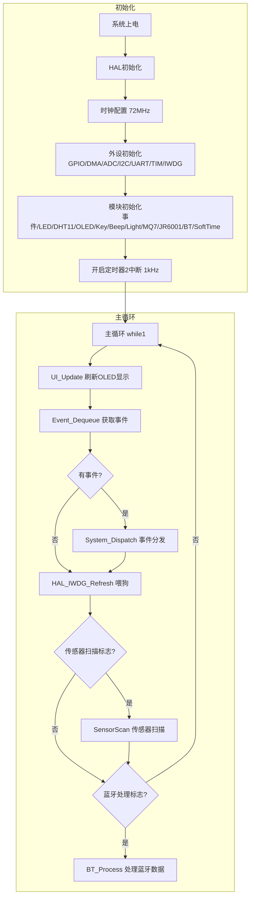
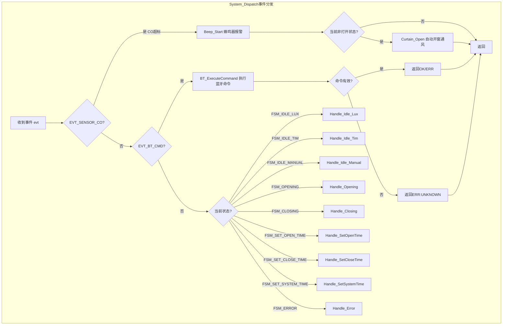
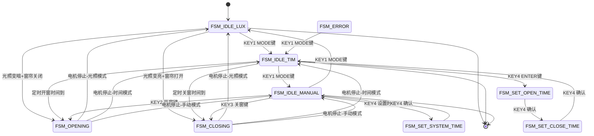
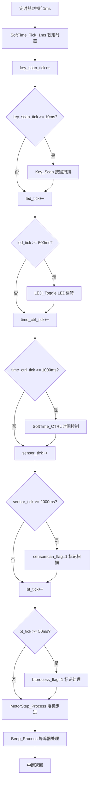
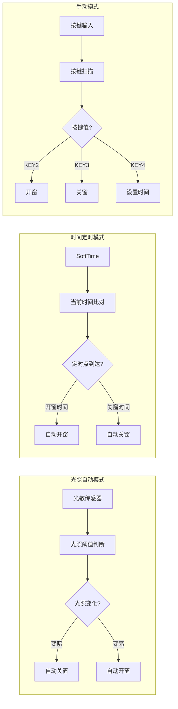

# 智能窗帘控制系统 - 流程图集

---

## 1. 系统总体流程图

---

## 2. 事件分发流程图

---

## 3. 状态机流程图

---

## 4. 定时器中断处理流程

---

## 5. 三种工作模式对比

---

> **说明**：本流程图集使用 Mermaid 语法编写，可直接在支持 Markdown 和 Mermaid 的编辑器（如 VS Code、Typora、GitHub 等）中预览渲染效果。
