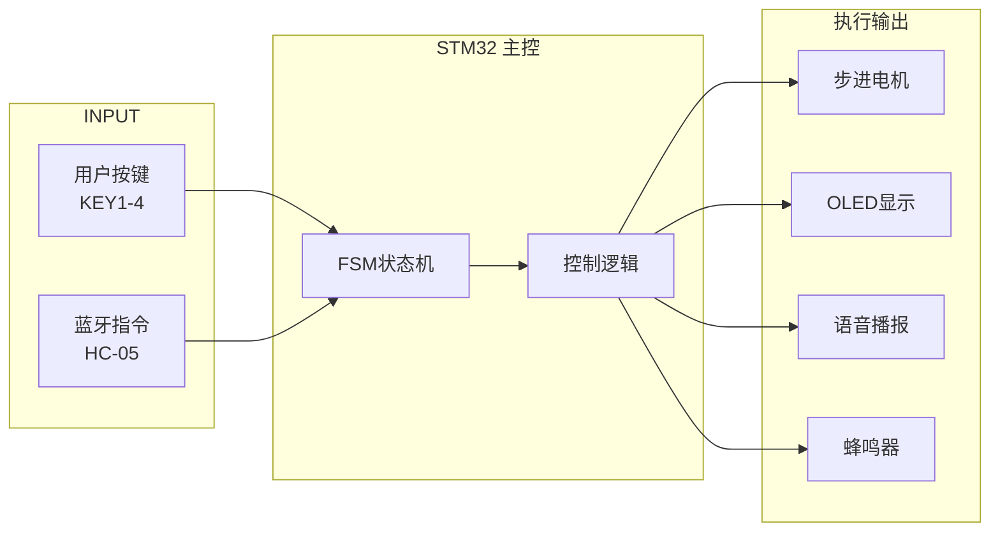
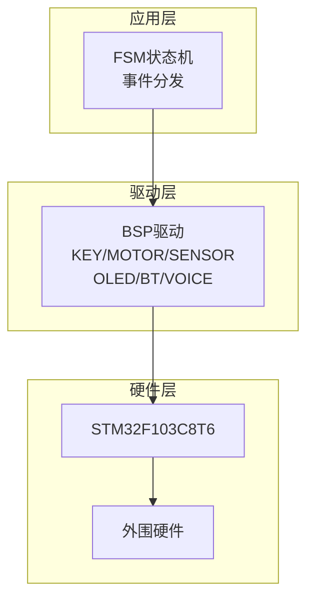

# 智能窗帘控制系统 - 硬件结构框图
# Mermaid 版本

## 系统总体架构

```mermaid
flowchart TB
    subgraph POWER["电源系统"]
        P5V["5V 电源"]
        P3V3["3.3V 稳压"]
    end
    
    P5V --> P3V3
    
    subgraph MCU["STM32F103C8T6 主控"]
        direction TB
        CORE["ARM Cortex-M3<br/>72MHz | 64KB Flash | 20KB SRAM"]
        
        subgraph PERIPH["外设"]
            direction LR
            ADC["ADC<br/>PA0, PA1"]
            UART["UART<br/>USART2(PA2,3)<br/>USART3(PB10,11)"]
            I2C["I2C<br/>I2C1(PB6,7)"]
            TIM["TIM<br/>TIM2,3,4"]
            IWDG["IWDG<br/>独立看门狗"]
        end
        
        CORE --> PERIPH
    end
    
    P3V3 --> MCU
    
    subgraph SENSOR["传感器模块"]
        LIGHT["光照: GL5528 → PA0"]
        CO["CO: MQ-7 → PA1"]
        DHT["温湿度: DHT11 → PA11"]
    end
    
    subgraph DRIVER["驱动模块"]
        MOTOR["步进电机<br/>28BYJ-48 + ULN2003<br/>PB8,9,PA12,15"]
    end
    
    subgraph COMM["通信模块"]
        BT["HC-05 蓝牙<br/>USART2"]
        VOICE["JR6001 语音<br/>USART3"]
    end
    
    subgraph DISPLAY["显示模块"]
        OLED["0.96\" OLED<br/>SSD1306 I2C"]
    end
    
    subgraph INPUT["输入模块"]
        KEY1["KEY1: 模式"]
        KEY2["KEY2: 打开"]
        KEY3["KEY3: 关闭"]
        KEY4["KEY4: 确认"]
    end
    
    subgraph OUTPUT["指示/报警"]
        LED["红色LED<br/>PB0"]
        BEEP["蜂鸣器<br/>PC13"]
    end
    
    MCU --> SENSOR
    MCU --> DRIVER
    MCU --> COMM
    MCU --> DISPLAY
    MCU --> INPUT
    MCU --> OUTPUT
```

## 数据流图



## 层次架构


